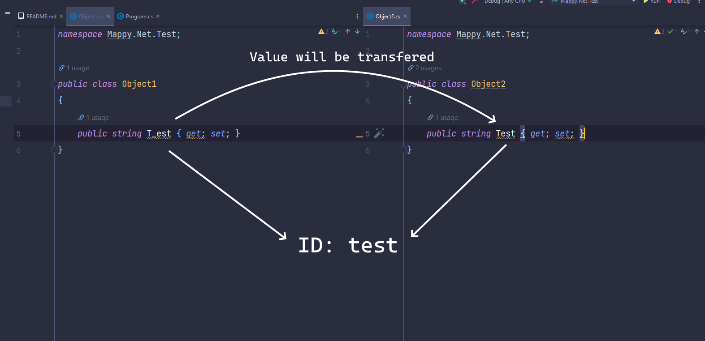

# Mappy.Net #
### A simple object mapper for c# ###

[](https://nuget.org/packages/mappy.net)

Mappy.Net is a little object mapper. Mappy.Net converts all property names to
an id and transfers the value of the input to the output object. As i said, very basic 😀

### How to use ###

````csharp
Object2 mapped = Mapper.Map<Object2>(new Object1());
````



### Install ###

You can either build it yourself or use the nuget package

### License

Well on this little piece of code a license would be useless 😁

